# REAME.md

###### <sub>DIY&amp;搬运工:只是站在巨人的肩膀上</sub>MINI-VLOOK:VLOOK™简化版<u>2025.01.28</u>​**路人二**​*对外公开*​*​`3.0.0`​*​ *COPYRIGHT©2022-2025 路人二.All Right Reserved*

‍

< *作者**​`路人二`​*​*<sub>T1</sub>* | *对外公开**​`3.0.0`​*​*<sub>Gn</sub>* | *日期**​`2025-01-28`​*​*<sub>Bu</sub>* ]

# 为什么要做 mini-vlook

1. 喜欢 `Siyuan`​ 软件，喜欢 `Typora`​ + `vlook`​ 的编辑体验，但 `Siyuan`​ 和 `Typora`​ 上视觉上不统一。
2. 集市的主题里，每个主题都有我喜欢的点。
3. 有些自己想要的小众功能，但集市里的主题没有。

# mini-vlook现在有什么

1. 8 种配色方案随心切换:  *​`bug320配色`​*​、*​`Fancy配色`​*​、*​`Geek配色`​*​、*​`Hope配色`​*​、*​`Joint配色`​*​、*​`Owl配色`​*​、*​`Solaris配色`​*​、*​`Thinking配色`​*
2. Siyuan主界面优化：仿OneNote主题彩虹文档树、大纲列表自动编号、仿Savor主题现代化的底栏、仿OneNote软件标签页样式；
3. VLOOK27新版语法（推荐）：*​`微章`​*​ <kbd>CTRL</kbd>​+<kbd>W</kbd>​、*​`微章-复选框`​*​、*​`微章-计数任务`​*​、*​`注音`​*​<kbd>CTRL</kbd>​+<kbd>I</kbd>​+<kbd>H</kbd>​、*​`刮刮卡`​*​ <kbd>CTRL</kbd>​+<kbd>ALT</kbd>​+<kbd>C</kbd>​、*​`进度条`​*​ <kbd>CTRL</kbd>​+<kbd>ALT</kbd>​+<kbd>B</kbd>​、*​`步骤条`​*​<kbd>CTRL</kbd>​+<kbd>ALT</kbd>​+<kbd>S</kbd>​

    1. 支持通过 TIP悬浮快捷菜单设置
    2. 支持通过右键菜单：添加/修改颜色、编辑文本、前面添加空格、后面添加空格
4. VLOOK13语法兼容（不推荐）：微章（*属性**​`f=wz`​*​*关闭**<sub>Rd!</sub>* ）、刮刮卡（*属性**​`f=rb`​*​*关闭**<sub>Rd!</sub>* ）、注音（*属性**​`f=pg`​*​*关闭**<sub>Rd!</sub>* ）、下拉选择（*属性**​`f=cx`​*​*关闭**<sub>Rd!</sub>* ）

    1. 通过快捷键 <kbd>CTRL</kbd>​+<kbd>ALT</kbd>​+<kbd>0</kbd>​ 可全局禁用或者开启VLOOK13语法
    2. 通过快捷键 <kbd>CTRL</kbd>​+<kbd>0</kbd>​ 全局渲染当前页所有的VLOOK13语法
5. 引述块增强：引述块小标题、引述分栏、彩虹引述块、备忘与警示样式(Github Style Alert： *​`[!NOTE]`​* ​、 *​`[!TIP]`​* ​、 *​`[!IMPORTANT]`​* ​、 *​`[!WARNING]`​* ​、 *​`[!CAUTION]`​* ​\)
6. 列表增强-视图转换：可转换为 *​`表格`​*​*f=bt**<sub>Gn!</sub>* 、 *​`导图`​*​*f=map**<sub>Gn!</sub>*  、*​`看板`​*​*f=kb**<sub>Gn!</sub>*  、*​`看板仿workflowy`​*​*f=kbw**<sub>Gn!</sub>*
7. 扩展命令@@函数: *​`range`​*​生成时间范围、*​`map`​*​生成导图、*​`kanban`​*​生成看板、*​`kbw`​*​生成仿workflowy 看板;
8. 其他小功能：*​`文字竖排`​*​*f=sp**<sub>Gn!</sub>* 、 多级标签渲染增强、链接前自动添加小标题、标题自动编号（*属性**​`f=bt`​*​*关闭**<sub>Rd!</sub>* ）、Card视图（*​`转视图`​*​*f=card**<sub>Gn!</sub>*  、*​`无图片生成占位图`​*​*f=card.img-top**<sub>Gn!</sub>*   、*​`连续Card分栏显示`​*​*f=card.list**<sub>Gn!</sub>* ）

‍

‍

# 功能项介绍

## VLOOK内容标记增强

> [!TIP]
>
> 对于VLOOK13语法的开关方式：通过 <kbd>CTRL</kbd>​+<kbd>ALT</kbd>​+<kbd>0</kbd>​ 切换开启和关闭，默认开启；开启后在文档内按下任意键，将解析并渲染当前行中符合条件代码块；通过 <kbd>CTRL</kbd>​+<kbd>0</kbd>​ 可渲染整个页面；不推荐使用VLOOK13语法，后期版本中，相关功能可能会移除。

### 微章

---

> **VLOO27语法**
>
> * 通过快捷键 <kbd>ALT</kbd>​+<kbd>W</kbd>​ 可设置选中文本为单级标签；选中单级微章中的部分内容，通过<kbd>CTRL</kbd>​+<kbd>G</kbd>​ 可改变为多级微章；
> * 可以通过右键菜单改变颜色、设置各级微章中的内容；
> * 目前不支持VLOOK中的变量、颜色渐变语法

> ==VLOOK13语法(不推荐)==
>
> * 对 `` `#微章标题|微章内容#(颜色)` ``​ 的形式将解析为多级微章(自定义属性f=wz可关闭)
> * 也可以写成`#微章标题#`​显示为单级微章
> * ​`(颜色)`​ 可以省略，支持 red、orange、yellow、lime、green、aqua、cyan、blue、sea、steel、purple、magenta、pink、gold、brown、gray、black、theme1、theme2

### 刮刮卡

---

> **VLOOK27语法**
>
> * 通过快捷键 <kbd>CTRL</kbd>​+<kbd>ALT</kbd>​+<kbd>C</kbd>​ 可设置选中文本为刮刮卡，默认提示信息为 “....”；
> * 可通过右键菜单改变颜色、编辑内容

> ==VLOOK13语法（不推荐）==
>
> * 对`` `*{提示信息}(隐藏在里面的内容) "颜色"` ``​
> * 颜色取值和微章一样，自定义属性f=wz可关闭

### 注音

---

> **VLOOK27语法**
>
> * 通过快捷键 <kbd>CTRL</kbd>​+<kbd>I</kbd>​+<kbd>H</kbd>​ 可设置选中文本为注音内容
> * 暂不支持右键菜单操作

> ==VLOOK13语法（不推荐）==
>
> * 可以给生僻字注音，或者给增加中英文一起的效果。语法：`` `{被注音内容}(注音内容)` ``​
> * 通过 f=pg 可关闭渲染

### 进度条

> **VLOOK27语法**
>
> * 通过快捷键 <kbd>CTRL</kbd>​+<kbd>ALT</kbd>​+<kbd>B</kbd>​ 可设置选中数字文本为进度条；
> * 为具体值0-100时，显示为固定数值；超过100或者小于0时显示为溢出状态；
> * 暂不支持 `?`​ 语法

### 步骤条/面包屑

> **VLOOK27语法**
>
> * 通过快捷键 <kbd>CTRL</kbd>​+<kbd>ALT</kbd>​+<kbd>S</kbd>​ 可设置选中文本为步骤条
> * 支持对面包屑内容进行分段的符号： `>`​ `/`​ `\`​ `->`​ `→`​ `▸`​ `▶︎`​
> * 通过右键菜单可编辑内容、前后插入空格

### 计数任务

> **VLOOK27语法**
>
> * 通过TIP悬浮快捷菜单设置计数任务
> * 支持通过右键菜单设置颜色、编辑内容
> * 点击数字部分数据会增加

### 复选框

> **VLOOK27语法**
>
> * 通过TIP悬浮快捷菜单设置计数任务
> * 支持通过右键菜单设置颜色、编辑内容
> * 点击复选框部分会切换“选中”和“未选中”的部分

### 下拉选择

> ==VLOOK13语法（不推荐）==
>
> * 语法类似 `^[选中项数字]>(选项1)(选项2)(选项……)(选项N)`​ ，比如 `^[0]>(内测版)(公测版)(正式版)`​，通过 f=cx 禁用当前块的渲染
> * 鼠标悬浮后可以选择其他内容

‍

## 引述块增强

### 引述块小标题

> 对引用块内首行设置为「**粗体**」或「==高亮==」即可。
>
> 语法：
>
> ```markdown
>> **这里是这个引用块的小标题**
>> xxxxx
>> xxxxx
>
>> ==这里是这个引用块的小标题==
>> xxxxx
>> xxxxx
> ```

###### 渲染效果：

​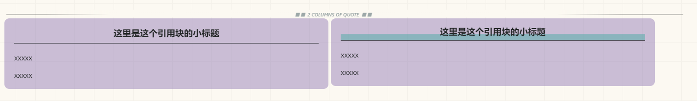​

### 彩虹引用

* 可以通过右键彩虹引用颜色，也可以在引用块第一行或最后一行添加色块（斜体+下标）。
* 支持的色块内容，色块内容忽略大小写，色块内容后面添加 `!`​ ,表示强调颜色

  * |色块内容|对应颜色|
    | -------------------------| -------------------------|
    |T1|ThemePrimary|
    |T2|THemeSecondary|
    |Gd|Gold|
    |Pk|Pink|
    |Ye|Yellow|
    |Lm|Lime|
    |Aq|Aqua|
    |La|Lavender|
    |Bn|Brown|
    |Ro|Rose|
    |Rd|Red|
    |Og|Orange|
    |Gn|Green|
    |Cy|Cyan|
    |Bu|Blue|
    |Vn|Vine|
    |Gy|Gray|
    |Pu|Purple|
    |Wn|Wine|
    |Ol|Olives|
    |Mn|Mineral|
    |Se|Sea|
    |Bk|Black|

​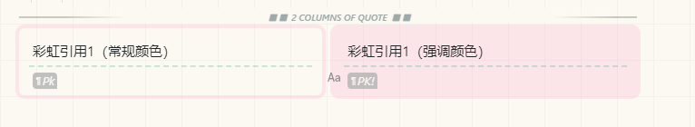​

### 引述分栏

在引述块前面添加分割线，可以让引述块分栏展示：

* 分两栏：1分隔线+引述块
* 分三栏：2分隔线+引述块
* 分四栏：3分隔线+引述块

‍

​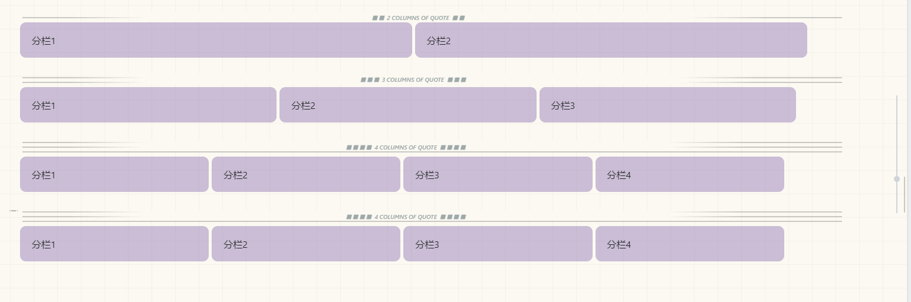​

‍

‍

### 备忘与警示样式(Github Style Alert）

通过右键菜单可以转换普通引述块转化为 Github Style Alert 样式，或者在第一行输入 `[!NOTE]`​ 等标识符，在 `[!NOTE]`​ 后面添加  `-`​ 或者 `+`​ 允许像 Callout 一样默认展开或折叠，存在 `-`​ 或 `+`​ 时，可以通过点击第一行展开和折叠样式。空一个空格后，可以在 标题栏上输入其他文本。

​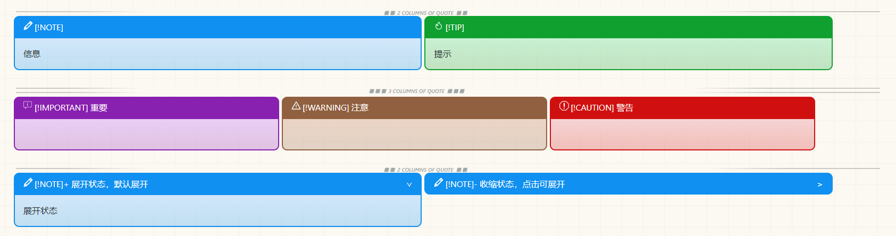​

‍

## 列表增强

### 列表分栏

在无序列表、有序列表或人物列表前面添加分割线，可以让引述块分栏展示：

* 分两栏：1分隔线+引述块
* 分三栏：2分隔线+引述块
* 分四栏：3分隔线+引述块
* 分五栏：4分隔线+引述块

###### 无序列表示例

​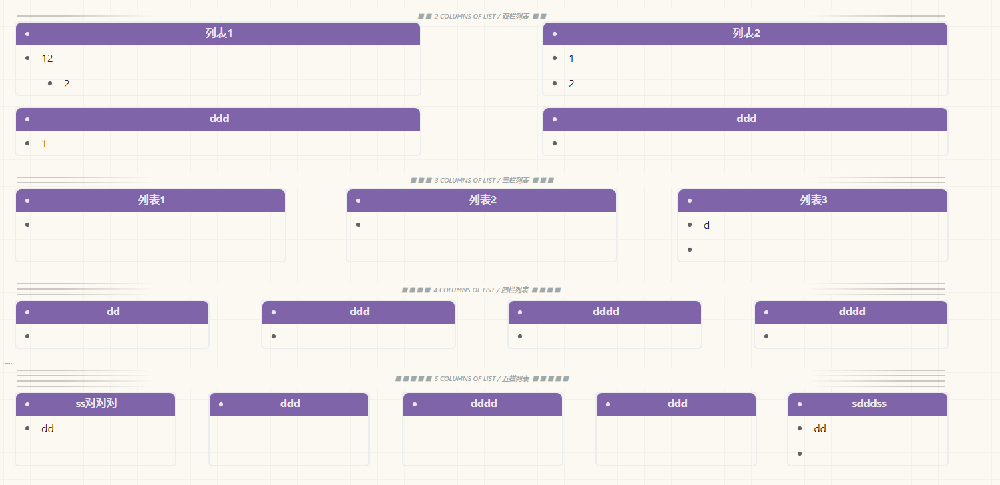​

### 视图转换

通过右键菜单>视图转换，可以把无序列表、有序列表或代办列表转换为表格、导图、看板或者仿workflowy样式的看板。

###### 列表转表格

​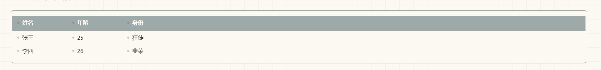​

###### 列表转导图

​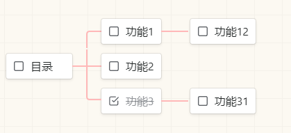​

###### 列表转看板

​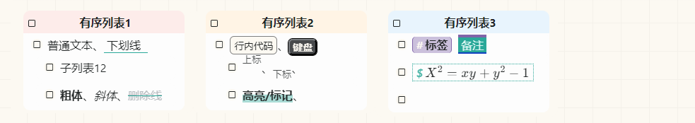​

###### 列表转workflowy样式看板

​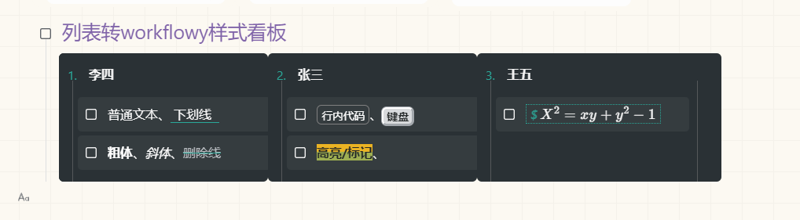​

‍

## 扩展命令@@函数

在 行内代码块 中输入 `@@函数名;`​ 可以执行一些内置的函数，内置函数有 `range`​、`map`​、`kanban`​、`kbw`​ 执行函数，在函数名后面需要输入 `;`​ 号

* range: 生成一个时间范围：

  * "@@range(9m);"可以创建一个从现在到九分钟后的时间范围，还支持"@@range(7:00+9m);"、"@@range(7:00,9m);" 这样的格式，其中 m 可以替换成 s、h 和 d,分别表示 秒、时间和天。
* map：生成一个导图
* kanban: 生成一个看板
* kbw： 生成一个仿 workflowy 看板

## 其他小功能

### 文字竖排

在段落中添加属性 *​`f=sp`​*​ 可以让段落文本竖排

​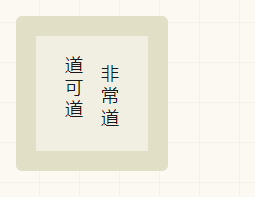​

### 多级标签渲染增强

包含 `/`​ 时渲染增强的分级

​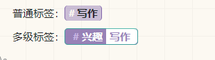​

### 连接前自动添加小标题

根据链接域名的不同会自动填充小标题在链接前面；

### 标题自动编号

文档内的标题自动编号，如果文档属性设置为 *​`f=bt`​*​ 将关闭该功能，

在标题后面添加类似 Savor 的 点，可以通过 *​`f=after`​*​ 关闭该功能

### Card视图（不推荐）

通过给引述块添加 `f=card`​ 属性，可以转换单个 card，添加 `f=card card.img-top`​ 属性，可以在开头添加占位图片（随主题切换）、在 card 中， 标题（1-5）、列表会进行特殊优化，以便更好的对卡片内容进行设计；

如果第一个卡片的属性包含 `f~=card.list`​ ,后面连续的 card 属性会分栏排列。

‍

​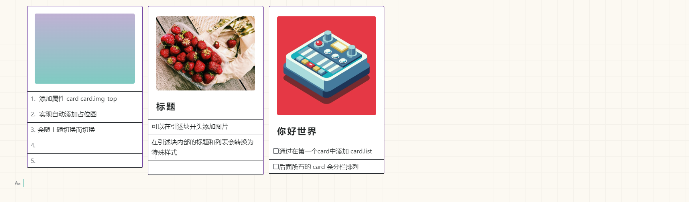​

# 参考/感谢

* 参考/感谢

  * [VLOOK](https://gitee.com/madmaxchow/VLOOK)

    * 配色、微章、引用分栏、注音、刮刮卡、封面等功能。
  * [Dark+](https://github.com/Zuoqiu-Yingyi/siyuan-theme-dark-plus)

    * 项目结构、自定义菜单、链接图标等功能。
  * [Zhang Light](https://github.com/UserZYF/zhang-light)

    * 分割线、4栏菜单、竖排、列表转表格等功能。
  * [notion-theme](https://github.com/royc01/notion-theme "notion-theme")

    * 列表转导图，看板标题循环色。
  * [OneNote主题](https://github.com/chenshinshi/OneNote)

    * 彩虹文档树等功能
  * [Savor主题](https://github.com/royc01/notion-theme)

    * 现代化底栏、列表转导图、看板、4栏菜单等功能

‍

# THE END
