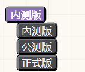

# mini-vlook 示例文档

###### ~DIV&搬运工：只是站在巨人的肩膀上~MINI-VLOOK: Vlook的简化版本^2023.09.28^`#对外公开|1.10.0#(green)`   **路人二***COPYRIGHT  © 2023 路人二. All Right Reserved*

<  `#作者|路人二#(theme1)` | `#对外公开|1.9.7#(green!)` | `#日期|2023-07-28#(blue)`  ]

---

---

---

* V1.9.7

  * 配色方案基于 VLOOK 17
  * 文字竖排块属性**f=sp**
  * 在文档块后方显示 custom-f 后面的内容。
  * 增加在列表块增加  **f=kbw**  实现仿 workflowy 看板渲染效果
  * 增加在 **f=card** 实现卡片效果，**f=card card.img-top**(没有图片默认添加变色块)，**f=card  card.list**（多个 card 同行显示）
  * 自动编号

    * 块属性**f=bt**可关闭
  * 标签解析增强

    * 微章

      * 块属性**f=wz**可关闭
    * 计数任务

      * 块属性**f=todo**可关闭
    * 注音

      * 块属性**f=pg**可关闭
    * 刮刮卡

      * 块属性**f=rb**可关闭
    * 下拉选择

      * 块属性**f=cx**可关闭
    * 彩虹引用

      * 块属性**f=bqcolor**可关闭
    * 分页引用

      * 块属性**f=bqtab**可关闭
    * 复选框

      * 块属性**f=chk**可关闭
      * 在行内代码块中输入(可以把x换成一个空格) 

        * +[ ]+
        * +[x]|标签+
        * +[ ]|标签+(red)
        * +[x]|标签+(red)
        * +[x]|标签+(red!)
     * 微章复选框

      * 块属性**f=chk-wz**可关闭
      * 在行内代码块中输入(可以把x换成一个空格) 

        * #[ ]#+
        * #[x]|标签#
        * #[ ]|标签#(red)
        * #[x]|标签#(red)
        * #[x]|标签#(red!)
    * 命令

      * `@@kanban;` 和 `@@map;` 快速生成`#看板#`和`#导图#`
      * `@@bqcolor;` 和 `@@bqtab;` 快速生成 `#彩虹引用#` 和 `#分页引用#`。
      * `@@range(9m)` 可以创建一个从现在到九分钟后的时间范围，还支持 `@@range(7:00+9m)`、`@@range(7:00,9m)` 这样的格式，其中 m 可以替换成 s、h和d,分别表示 秒、时间和天。
      * 命令需要在后面添加一个 ";" 来。
    * 全局禁用/开启

      * <kbd>Ctrl</kbd>+<kbd>Alt</kbd>+<kbd>0</kbd>
      * 左上角按钮【标签解析增强】
  * 封面&封底

    * 文档属性**theme=tm1…tm7**
  * 引用分栏  （文档属性`f=bc` 兼容旧版，会在当前页面关闭引用分栏功能）

    * 1分隔线+引用

      * 分2栏
    * 2分隔线+引用

      * 分3栏
    * 3分隔线+引用

      * 分4栏
  * 列表分栏

    * 1分隔线+分栏

      * 分2栏
    * 2分隔线+分栏

      * 分3栏
    * 3分隔线+分栏

      * 分4栏
  * 列表转表格

    * ~~1分隔线+列表~~ （文档属性`f=bc` 可兼容旧版）
    * 块属性f=bg
  * 列表转看板

    * ~~2分隔线+列表~~ （文档属性`f=bc` 可兼容旧版）
    * 块属性f=kb
  * 列表转导图

    * ~~3分隔线+列表~~ （文档属性`f=bc` 可兼容旧版）
    * 块属性f=map
  * 批注功能
  * 其他

    * 链接前自动匹配小图标
    * 文字竖排

      * 属性 f=sp
    * 标签渲染增强
    * OneNote左侧树状列表

## 为什么要做 mini-vlook？

1. 喜欢 `Siyuan` 软件，喜欢 `Typora` + `vlook` 的编辑体验，但 `Siyuan` 和 `Typora` 上视觉上不统一。
2. 集市的主题里，每个主题都有我喜欢的点。
3. 有些自己想要的小众功能，但集市里的主题没有。

## mini-vlook 现在有什么？

1. 列表转表格、列表转看板、列表转导图。
2. 行内代码增强解析：微章、刮刮卡、注音、计数任务。
3. 7款封面、封底（对应 `vlook` 的默认主题）。
4. 分栏引用。
5. 自动编号。
6. 常见 `url` 地址添加网站 `icon` 。
7. 文字竖排。
8. 同时支持明暗两种模式。

## mini-vlook 将会有什么？

1. 导出优化（现在只能在文档里看）。
2. 行内代码编辑小窗口。
3. 表格、图片的增强功能（不一定，取决于 `JavaScript` 学习到哪里吧）。

## 功能项介绍

### 代码块增强解析：微章、刮刮卡、注音、计数任务、下拉选择

`#注意|这些都是写在行内代码中的#`

`代码块解析功能` 开关方式： <kbd>Ctrl</kbd>  + <kbd>Alt</kbd> + <kbd>0</kbd> 或者思源笔记左上角的按钮关闭或开启渲染。  

在文档内按下 <kbd>Ctrl</kbd> + <kbd>0</kbd> ，立即渲染整篇文档。（改变！！2.0.0）

已渲染的需要在对应行输入字符，才会取消渲染效果。

###### `#功能|微章#(theme1!)`

* 添加内容块 `#自定义属性|f=wz#` ,  当前块不会渲染微章，具有层级关系时，会影响到当前块的所有子块内。

  * `#微章标题|微章内容#(颜色)` 或者 `#微章标题#(颜色)` 仅渲染标题
  * 其中 `(颜色)` 可以省略，即仅写为 `#微章标题|微章内容#` ，省略颜色时，渲染为内置的 `theme2`
  * 颜色可以写选择预定义的颜色名, 或者 `#ffffff` 格式的颜色值（*建议用预定的颜色名称*）

    ``` ts
    // 支持的颜色名称
    'red', 'orange', 'yellow', 'lime', 'green', 
    'aqua', 'cyan', 'blue', 'sea', 'steel', 'purple', 
    'magenta', 'pink', 'gold', 'brown', 'gray', 'black', 
    'theme1', 'theme2'
    ```
  * 可以在颜色后添加 `!` 强调微章内容。即写为 `#微章标题|微章内容#(red!)`

    `#微章标题|微章内容#` `#状态|未完成#(theme1)` `#对外公开|V1.0.0#(green)`  `#💡|提示#(orange)`

* 也可以仅有微章标题：`#微章标题#` `#状态#(theme1)` `#对外公开#(green)` `#💡#(orange)`

###### `#功能|刮刮卡#(theme1!)`

* 带有提示信息的 `#挖空#` 功能，可以设置颜色。语法：

  *  `*{提示信息}(隐藏在里面的内容)` 

    或者
  *  `*{提示信息}(隐藏在里面的内容 "red")`
* 颜色取值和 `#微章#` 一样。添加内容块 `#自定义属性|f=rb#` , 则禁用当前块的渲染。

 `*{提示信息}(隐藏在里面的内容)`  `*{提示信息}(隐藏在里面的内容 "red")`  `*{提示信息}(隐藏在里面的内容 "red")`  `*{提示信息}(隐藏在里面的内容 "red")`

###### `#功能|注音#(theme1!)`

* 可以给生僻字注音，或者给增加中英文一起的效果。语法：

  *  `{被注音内容}(注音内容)` ，如 `{道德经}(dao de jing)`  `{红色}(red)`
* 给内容块 `#自定义属性|f=pg#` ,   则禁用当前块的渲染。例子：

`{道德经}(dao de jing)`  `{红色}(red)`

###### `#功能|计数任务#(theme1!)`

* 点击 `#+|加号#`，可以让计数增加`+1`。语法：

  *  `+[起始数字](任务描述 "颜色")` ,如 `+[0](打卡次数)`   `+[0](打卡次数 "aqua")`
  * 颜色，可以省略，省略为默认颜色白色或者黑色根据明暗模式变化。
  * 内容块 `#自定义属性|f=todo#` , 则禁用当前块的渲染。
  * `#📌|缺陷#(red!)` (~~点加号以后，需要在同一行内，随便输入一些字符让变化存到数据库，比如输入一个空格并删除~~)

  `+[5](打卡次数)`  `+[5](打卡次数 "aqua")` `+[5](15分钟写作练习 "orange")`   `+[9](15分钟写作练习  "orange")`

###### `#功能|下拉选择#(theme1!)` 

* 悬浮的时候，会出现可选的下拉框。语法

  * `^[选中项数字]>(选项1)(选项2)(选项……)(选项N)` ，如 `^[0]>(内测版)(公测版)(正式版)` `+^[1]>(内测版)(公测版)(正式版)`
  * 内容块 `#自定义属性|f=cx#` , 则禁用当前块的渲染。
  * `#📌|缺陷#(red!)` (~~选择一项以后，需要在同一行内，随便输入一些字符让变化存到数据库，比如输入一个空格并删除~~)

`^[0]>(内测版)(公测版)(正式版)`  `^[2]>(内测版)(公测版)(正式版)`

展开时的效果：

###### `#功能|命令#(theme1)`

* 通过行内代码中用 `@@命令名称` 快速执行一些动作。语法:

  * `@@kanban`  快速生成看板
  * `@@map`       快速生成导图
  * 内容块 `#自定义属性|f=cmd#` , 则禁用当前块的渲染。

###### `#功能|其他功能#(theme1)`

* 双击行内代码块，可以立即取消渲染（全局的）。
* 右键菜单增加【编辑行内代码】块功能，方便编辑渲染后的内容。

  * 内容块 `#自定义属性|f=cx#` , 则禁用当前块的渲染。
  * `#📌|缺陷#(red!)` (~~选择一项以后，需要在同一行内，随便输入一些字符让变化存到数据库，比如输入一个空格并删除~~)

### 标签渲染增强

只有一层的标签`#标签#`

具有子层的标签`#标签1/标签2#` `#标签1/标签2/标签3#`


### 引用分栏

###### `#功能|引用分栏#(theme1!)`

1. 在引用前一行添加一个分割线（通过输入`---` 或者用 `/` ），下方连续的引用会自动左右分栏。
2. 如果有1个分割线，分2 栏；2个分割线，分3栏；3个分割线，分4栏。（最高支持4栏）   
    `#1分割线|分2栏#` `#2分割线分|分3栏#` `#3分割线|分4栏#`

---

>  分栏1
>

> 分栏2
>

---

---

> 分栏1
>

> 分栏2
>

> 分栏3
>

---

---

---

> 分栏1
>

> 分栏2
>

> 分栏3
>

> 分栏4
>


### 列表分栏

###### `#功能|列表分栏#(theme1!)`

1. 在列表前一行添加一个分割线（通过输入`---` 或者用 `/` ），下方连续的列表会自动左右分栏。
2. 如果有1个分割线，分2 栏；2个分割线，分3栏；3个分割线，分4栏。（最高支持4栏）   
    `#1分割线|分2栏#` `#2分割线分|分3栏#` `#3分割线|分4栏#`

---

* 分栏1
 * 内容 1
* 分栏2
 * 内容 2

---

---

* 分栏1
 * 内容 1
* 分栏2
 * 内容 2
* 分栏3
 * 内容 3

---

---

---

* 分栏1
 * 内容 1
* 分栏2
 * 内容 2
* 分栏3
 * 内容 3
* 分栏4
 * 内容 4


### 列表转表格

~~在列表前添加一个分割线 `#分割线|1个#`~~(已经移除，需要通过文档属性`f=bc`开启兼容) 或者添加自定义属性`#自定义属性|f=bg#` 。


* 

  * 姓名

    * 野原新之助

      * 等级

        * **★★★★★**
  * 年龄

    * 5岁

      * 性别

        * 男
  * 性格

    * 善良、活泼

      * 技能

        * `#幸运值|满级#(theme1!)`

### 列表转看板

~~在列表前添加两个连续的分割线 `#分割线|2个#`~~(已经移除，需要通过文档属性`f=bc`开启兼容)  或者添加自定义属性 `#自定义属性|f=kb#` 。

第一层列表会被渲染成 `看板标题`，各自的子层会渲染成 `看板卡片`。卡片支持`嵌套`，`折叠`和`拖放`。


* 未完成

  * 任务1
* 进行中

  * 任务2

    * 子任务1
    * 子任务2
  * 任务3
* 已完成

  * 任务4
  * 任务5
* 已归档

  * 任务6

### 列表转导图

~~在列表前添加三个连续的分割线 `#分割线|3个#`~~(已经移除，需要通过文档属性`f=bc`开启兼容)  或者添加自定义属性 `#自定义属性|f=map#` 。

* 中心节点

  * 节点1

    * 节点1
    * 节点2
    * 节点3
  * 节点2

    * 节点1
    * 节点2

### 其他功能

#### 封面和封底

给笔记添加文档属性 `#自定义属性|theme=tm1#` 。 其中 `#theme#` 的取值， 支持从 `#tm1#` 到 `#tm7#` ，分别对应七款封面和封底。

添加过文档属性后，会把当前文档中，第一行的 `H6` 标题渲染成封面，把最后一行的 `H1` 标题渲染成封底。

封面支持对特定标记具有一些特定排版效果：

> **标题**
>
>> * 默认格式就是标题格式，直接输入就可以了；
>> * 可结合 `HTML` 的`上标`、`下标`方式进行「小标题、副标题」的延伸应用：
>>
>>   * 小标题：`~文档大标题上的小标题~`
>>   * 副题：`^文档大标题下的副标题^`
>>
>
> **文档类型、等级**
>
>> 可使用 `徽章` 写法来实现，举例：
>>
>> * `#文档密级|对外公开#(green)`
>> * `#文档密级|内部公开#(orange)`
>> * `#文档密级|机密资料#(caution)`
>>
>
> **作者**
>
>> 使用 `Markdown` 的「**粗体**」格式标记出「**作者信息**」即可（会自动添加前缀 `By`、加粗），举例：`**我是作者**`
>>
>
> **版权信息**​
>
>> 使用 `Markdown` 的「**斜体**」格式标记出「**版权信息**」即可（会自动缩小字号、加粗），举例：`*(C)2020. 版权所有*`
>>
>

比如下面的 `h6` 会在`theme` 取值为 `tm1` ~ `tm7` 下会被分别渲染成：

```css
###### ~DIV&搬运工：只是站在巨人的肩膀上~MINI-VLOOK: Vlook的简化版本^2022.04.20^`#对外公开|0.0.1#(green)`  **路人二***COPYRIGHT  © 2022 路人二. All Right Reserved*
```


#### 链接自动添加图标

[github](www.github.com "github")

#### 文字竖排

在内容块添加自定义属性 `#f=sp#` 即可。

你好世界

#### 评论

Dark+ 主题的评论功能。感谢大佬！


## 参考/感谢

---

* 参考/感谢

  * [VLOOK](https://gitee.com/madmaxchow/VLOOK)

    * 配色、微章、引用分栏、注音、刮刮卡、封面等功能。
  * [Dark+](https://github.com/Zuoqiu-Yingyi/siyuan-theme-dark-plus)

    * 项目结构、自定义菜单、链接图标、批注等功能。
  * [Zhang Light](https://github.com/UserZYF/zhang-light)

    * 分割线、4栏菜单、竖排、列表转表格等功能。
  * [notion-theme](https://github.com/royc01/notion-theme "notion-theme")     

    * 列表转导图，看板标题循环色
  * [OneNote](https://github.com/UserZYF/OneNote)

    * 左侧树状列表
  
  * [StarDustSheep](https://github.com/StarDustSheep)
  
    * 感谢大佬提供的集市图标

    <br />


# The End
